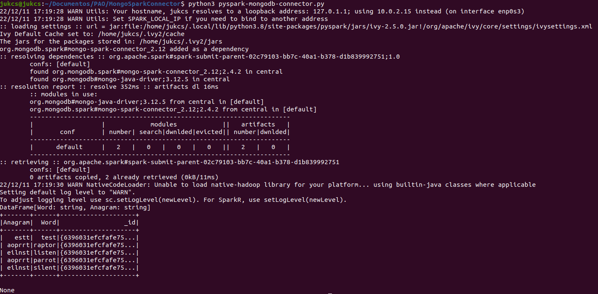
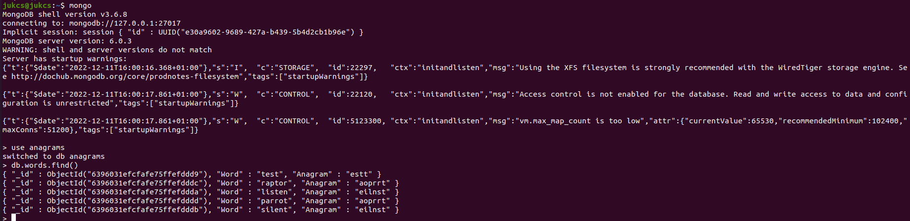

# MongoDB Spark Connector

## **Prerequisites**
### <u> MongoDB </u>
* Use this [tutorial](https://www.mongodb.com/docs/manual/tutorial/install-mongodb-on-ubuntu/) to install MongoDB 6.0 Community Edition on LTS (long-term support) releases of Ubuntu Linux using the apt package manager.

* Although it is not necessary you can create the database and collection it in advance:
```
mongo
use anagrams
db.words.insertOne({’estt’:’test’})
db.words.find()
```

### <u> Spark </u>
* To install just run:
```
pip install pyspark
```

## **Code**

This tutorial uses the pyspark library as a self-contained Python application.

### <u>  Configuration Options </u>
```
input_uri = "mongodb://127.0.0.1/anagrams.words"
output_uri = "mongodb://127.0.0.1/anagrams.words"
```
* The spark.mongodb.input.uri specifies the MongoDB server address (127.0.0.1), the database to connect (anagrams), and the collection (words) from which to read data, and the read preference.

* The spark.mongodb.output.uri specifies the MongoDB server address (127.0.0.1), the database to connect (anagrams), and the collection (words) to which to write data. Connects to port 27017 by default.

* The packages option specifies the Spark Connector's Maven coordinates, in the format groupId:artifactId:version.

### <u> SparkSession </u>

In a standalone Python application, you need to create your SparkSession object explicitly, as show below.

```
my_spark = SparkSession\
    .builder\
    .appName("AnagramsApp")\
    .config("spark.mongodb.input.uri", input_uri)\
    .config("spark.mongodb.output.uri", output_uri)\
    .config('spark.jars.packages','org.mongodb.spark:mongo-spark-connector_2.12:2.4.2')\
    .getOrCreate()
```

You can use a SparkSession object to write data to MongoDB, read data from MongoDB, create DataFrames, and perform SQL operations.

### <u> Write to MongoDB </u>
After creating a SparkSession object, use the object's createDataFrame() function.
```
words = my_spark.createDataFrame([("test",  "estt"), ("listen", "eilnst"), ("silent", "eilnst"), ("raptor", "aoprrt"), ("parrot", "aoprrt")], ["Word", "Anagram"])
```
Write the words DataFrame to the MongoDB database and collection specified in the spark.mongodb.output.uri option by using the write method:
```
words.write.format("com.mongodb.spark.sql.DefaultSource").mode("append").save()
```
***Note*** : It is important to use the default data source to avoid the following execution error:

```
java.lang.ClassNotFoundException: Failed to find data source: com.mongodb.spark.sql.DefaultSource
```

### <u> Read from MongoDB </u>
You can create a Spark DataFrame to hold data from the MongoDB collection specified in the spark.mongodb.input.uri option which your SparkSession option is using.

Assign the collection to a DataFrame with spark.read() and print.
```
df = my_spark.read.format('com.mongodb.spark.sql.DefaultSource').load()

print(df.show())
```
## **Code Execution**
To execute just run:
```
python3 pyspark-mongodb-connector.py
```
### <u> PySpark </u>



### <u> MongoDB </u>

