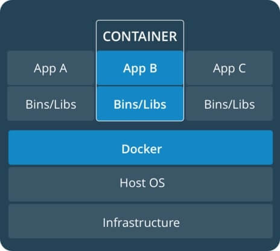
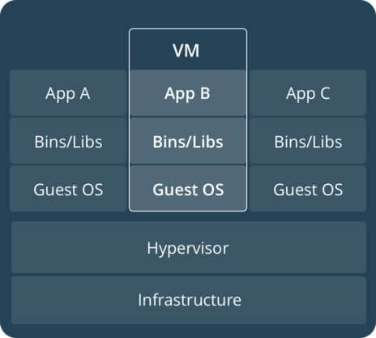

# TP1.1 : Introduction à la conteneurisation

## **Introduction**

Pour comprendre pourquoi la technologie Docker est devenue de nos jours si populaire que ça, il est important d'abord de comprendre quel est l'intérêt des conteneurs en le comparant à la virtualisation. La finalité de ce TP est la création de l’image Docker qui permettra de réaliser tous les TPs de l’EC Big Data.

## **La virtualisation**
### <u> Fonctionnement </u>
* Le fonctionnement de la virtualisation reste assez simple : au lieu d’avoir un serveur avec un système d’exploitation faisant tourner une ou plusieurs application(s), on préférera mutualiser plusieurs serveurs virtuels depuis un serveur physique grâce à un logiciel nommé l’hyperviseur. L’hyperviseur permet d’émuler intégralement les différentes ressources matérielles d'un serveur physique (tels que l'unité centrale, le CPU, la RAM, le disque dur, carte réseau etc ...), et permet à des machines virtuelles de les partager.
  
* Ainsi ces machines virtuelles nommées aussi VM (Virtual Machine) bénéficieront de ressources matérielles selon leurs besoins (par exemple plus de puissance processeur et plus de mémoire vive mais avec moins d’espace disque). L'avantage c'est qu'il est possible de modifier les ressources physiques de ces VMs en quelques clics. De plus, elles possèdent leur propre système d’exploitation ainsi que leurs propres applications.

### <u> Avantages </u>
* Consacrer les ressources adaptées selon les applications qu'on souhaite mettre en place.
* Les machines virtuelles restent simples à manier. Il est possible par exemple de basculer une VM d'un lieu à l'autre voir même de sauvegarder et de dupliquer une VM à volonté sans aucun impact visible pour les utilisateurs.
* La virtualisation réduit les dépenses en abaissant le besoin de systèmes matériels physiques. Elle permet ainsi de réduire la quantité d'équipement nécessaire et les coûts de maintenance d'alimentation et de refroidissement des composants.
* Les machines virtuelles apportent également une aisance à l'administration car un matériel virtuel n'est pas sujet aux défaillances. Les administrateurs profitent des environnements virtuels pour faciliter les sauvegardes, la reprise après catastrophe.

### <u> Inconvénients </u>

* Le fait d’accéder aux ressources de façon virtuelle affaiblit les performances. En effet, on passe par une couche d’abstraction matérielle qui malheureusement doit faire des interprétations entre le matériel en place et celui simulé dans la machine virtuelle.
  
* Comme expliqué plus haut, la virtualisation consiste à faire fonctionner sur un seul ordinateur physique plusieurs VMs avec différents systèmes d'exploitation, comme s'ils fonctionnaient sur des ordinateurs distincts. Mais malheureusement cette couche d'OS consomme à elle toute seule énormément de ressources alors qu’au final, ce qui nous intéresse c’est la ou les applications qui vont tourner dessus.

## **La conteneurisation**
### <u> L'isolation </u>

* Dans le cas de la virtualisation, l’isolation des VMs se fait au niveau matérielles (CPU/RAM/Disque) avec un accès virtuel aux ressources de l'hôte via un hyperviseur. De plus, généralement les ordinateurs virtuels fournissent un environnement avec plus de ressources que la plupart des applications n'en ont besoin.

* Par contre dans le cas de la conteneurisation, l’isolation se fait au niveau du système d’exploitation. Un conteneur va s'exécuter sous Linux de manière native et va partager le noyau de la machine hôte avec d'autres conteneurs. ne prenant pas plus de mémoire que tout autre exécutable, ce qui le rend léger.

 

### <u> Avantages par rapport à la virtualisation </u>

* Comme vu plus haut, les machines virtuelles intègrent elles-mêmes un OS pouvant aller jusqu’à des Giga-octets. Ce n'est pas le cas du conteneur. Le conteneur appel directement l'OS de la machine hôte pour réaliser ses appels système et exécuter ses applications. Il est beaucoup moins gourmand en ressources
  
* Le déploiement est un des points clés à prendre en compte de nos jours. On peut déplacer les conteneurs d’un environnement à l’autre très rapidement (en réalité c'est encore plus simple et rapide avec Docker, car il suffit juste de partager des fichiers de config qui sont en général très légers). On peut bien sur faire la même chose pour une machine virtuelle en la déplaçant entièrement de serveurs en serveurs mais n'oubliez pas qu'il existe cette couche d'OS qui rendra le déploiement beaucoup plus lent, sans oublier le processus d'émulation de vos ressources physiques, qui lui-même demandera un certain temps d'exécution et donc de la latence en plus.

La conteneurisation est de plus en plus populaire car les conteneurs sont :
1. ***Flexible*** : même les applications les plus complexes peuvent être conteneurisées.
2. ***Léger*** : les conteneurs exploitent et partagent le noyau hôte.
3. ***Interchangeable*** : vous pouvez déployer des mises à jour à la volée
4. ***Portable*** : vous pouvez créer localement, déployer sur le cloud et exécuter n'importe où votre application.
5. ***Évolutif*** : vous pouvez augmenter et distribuer automatiquement les réplicas (les clones) de conteneur.
6. ***Empilable*** : vous pouvez empiler des services verticalement et à la volée.

## **Pourquoi pense-t-on conteneurisation = Docker** ?

La conteneurisation est loin d'être une technologie récente. En réalité les conteneurs ne sont pas si nouveaux que ça, comme on pourrait le croire. On peut citer quelques technologies comme Chroot sur Unix (1982), Jail sur BSD (2000), conteneurs sur Solaris (2004), LXC (Linux containers) sur Linux (2008). La célébrité de Docker vient du fait qu'il a su permettre aux utilisateurs de gérer facilement leurs conteneurs avec une interface en ligne de commande simple. Dans la même veine que Docker, le projet de RedHat, Podman, prend de plus en plus d'importance dans ce marché.
Les conteneurs ne sont pas nouveaux, mais leur utilisation pour déployer facilement des applications l'est.

## **Définition du Dockerfile et principales commandes**

Pour créer une image Docker, il faut tout d’abord créer ce que l’on appelle un Dockerfile. Dans ce fichier, vous allez trouver l'ensemble de la “recette” décrivant l'image Docker dont vous avez besoin pour votre projet.

Chaque instruction que nous allons donner dans notre Dockerfile va créer une nouvelle couche (layer) correspondant à chaque étape de la construction de l'image, ou de la “recette”.

Si nous restons dans l'analogie de la cuisine, le Dockerfile permet de connaître notre recette pour faire une pièce montée. Alors, chaque argument de celle-ci crée un nouvel étage sur la pièce montée, nommé layer. Notre but étant de limiter le nombre d'étages, pour que notre pièce montée soit la plus légère et performante possible. Vous trouverez ci-dessous les différentes commandes permettant de créer un Dockerfile.

* `FROM` : Définit l'image de base qui sera utilisée par les instructions suivantes.
* `LABEL` : Ajoute des métadonnées à l'image avec un système de clés-valeurs, permet par exemple d'indiquer à l'utilisateur l'auteur du Dockerfile.
* `ARG` : Variables temporaires qu'on peut utiliser dans un Dockerfile.
* `ENV` : Variables d'environnements utilisables dans votre Dockerfile et conteneur.
* `RUN` : Exécute des commandes Linux ou Windows lors de la création de l'image. Chaque instruction RUN va créer une couche en cache qui sera ré-utilisée dans le cas de modification ultérieure du Dockerfile.
* `COPY` : Permet de copier des fichiers depuis la machine locale vers le conteneur Docker.
* `ADD` : Même chose que COPY mais prend en charge des liens ou des archives (si le format est reconnu, alors il sera décompressé à la volée).
* `ENTRYPOINT` : comme son nom l'indique, c'est le point d'entrée de votre conteneur, en d'autres termes, c'est la commande qui sera toujours exécutée au démarrage du conteneur. Il prend la forme de tableau JSON (ex : CMD ["cmd1","cmd1"]) ou de texte.
* `CMD` : Spécifie les arguments qui seront envoyés au ENTRYPOINT, (on peut aussi l'utiliser pour lancer des commandes par défaut lors du démarrage d'un conteneur). Si il est utilisé pour fournir des arguments par défaut pour l'instruction ENTRYPOINT, alors les instructions CMD et ENTRYPOINT doivent être spécifiées au format de tableau JSON.
* `WORKDIR` : Définit le répertoire de travail qui sera utilisé pour le lancement des commandes CMD et/ou ENTRYPOINT. Cela sera aussi le dossier courant lors du démarrage du conteneur.
* `EXPOSE` : Expose un port.
* `VOLUMES` : Crée un point de montage qui permettra de faire persister les données.
* `USER` : Désigne quel est l'utilisateur qui lancera les prochaines instructions RUN, CMD ou ENTRYPOINT (par défaut c'est l'utilisateur root).

## Références

* https://devopssec.fr/article/differences-virtualisation-et-conteneurisation
* https://www.veritas.com/fr/ch/information-center/containerization#:~:text=Alors%20que%20la%20virtualisation%20est,vous%20pouvez%20utiliser%20plus%20efficacement.
* https://learn.microsoft.com/fr-fr/dotnet/architecture/microservices/container-docker-introduction/
